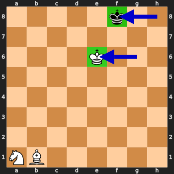
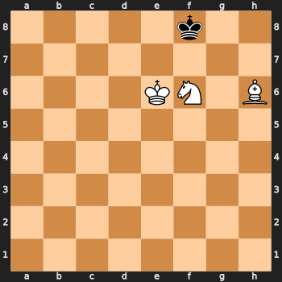
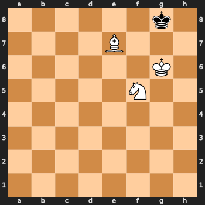

# Hikarrro
## Introduction
This is a chess game, we play black, AI plays white. The starting board only consists of knight, bishop and king for white, and the single king for black. We can seed the starting positions of the 4 pieces from the given AI scenarios. Our goal is to end the game not losing with both kings at the given positions - white at E6, black at F8.



This is a really compilcated challenge which I spent more than a day to solve with crucial help from teammate Connor who is a great chess player.

He mentioned it is a rare scenario for the board with these pieces. It is not an easy task for white to checkmate.

The code is too messy but I don't have the intention to clean it. I did upload some scripts:
1. `play.py`: the pretty formatted version of the minified `play_min.py`.
2. `find_necessary_hard_AI.py`: which is to get from remote how the hard AI should react at non-typical scenarios, by using DFS to roll back that scenario to one of the possible opening moves.
3. `play_demo_brute.py`: the actual solve script after knowing how the hard AI moves under some scenarios.

## AI principle
There are the files `xy_python.bin` listing out how AI moves when it is one of the 10817184 scenarios. I call it `Easy AI`. It doesn't cover all scenarios. So there is the complicated ELF `thinkingharder` which decides how AI plays when it's not what `Easy AI` can handle. I call this `Hard AI`. It's so difficult to reverse it, to make it worse, I couldn't run it locally. Therefore, I decided to connect to remote to get the result when needed.

## Brute forcing the seed
There are only 10817184 scenarios in the AI, we can brute force to get a desired string to generate any scenario we want. I generated it and exported into `seed_map.txt` in `zip` format.

## First attempt: stalemate
The easiest attempt is to end the game by stalemate, and the only possible scenario is as below.



I could brute force all possible board just before the last white move, and check if the AI will play to the stalemate position. Sadly it fails --- How could AI play to the stalemate scenario if it could win?

## Second attempt: Three-fold repetition
At this point I am lost, I don't know what I could do. Luckliy Connor hinted that we could do a threefold repetition or fifty-move rule. He further spotted the name of challenge `Hikarrro` is with 3 `r`'s, strongly implying it's the threefold repetition. With that in mind, I believe there must be a cycle which passes through some scenarios on board which the kings are at the given positions.

I create a directional graph for white scenarios as node. If there is a repetition, there has to be a strongly connected components in the graph. So I create the graph with initially putting to queue the possible 3,204 white-to-move-next scenarios which the two kings are at the specific position. When I simply do it for `Easy AI`, it didn't contain any strongly connected components.

With this result, it's time to work with the `Hard AI`, it's reasonable...otherwise why the author gives me this file?

For the graph structure created above with `Easy AI` only, there are scenarios that the `Easy AI` couldn't handle so I can't proceed continuing on the graph. For each of these complicated scenarios, I wrote the backward board exploration function and DFS to find the backward paths from the target scenario back to any initial seeded board. Then send the moves to remote to get what the `Hard AI` will do. I then use this new result to re-draw the entire graph, and repeat the entire process.

The `Hard AI` moves I found is as follows:

```python
advanced_AI = {
    # 1st iteration
    (44, 43, 18, 61): (44, 45),
    (45, 37, 52, 63): (45, 46),
    (46, 37, 52, 62): (46, 38),
    (21, 20, 12, 15): (12, 5),
    (28, 29, 21, 5): (28, 20),
    (60, 26, 51, 56): (51, 58),
    (20, 52, 37, 6): (37, 19),
    (52, 19, 26, 48): (26, 53),
    (45, 31, 58, 62): (31, 46),
    # 2nd iteration
    (26, 20, 18, 1): (26, 17),
    (19, 36, 21, 4): (19, 20),
    (20, 28, 51, 5): (20, 11),
    (50, 61, 12, 48): (61, 51),
    (45, 11, 10, 62): (11, 26),
    # 3rd iteration
    (21, 36, 1, 15): (1, 37),
    (45, 37, 7, 63): (37, 47),
    (26, 46, 7, 57): (26, 34),
    (45, 17, 7, 62): (17, 34),
}
```

Now I got a strongly connected components of size 550. Clearly threefold repetition is possible, now I need to get the scenario which the repetition happens at the desired king positions. However, it was so difficult for me to understand how the repetition works or how to control the repetition to appear at a certain position. I was getting frustrated not be able to find it out. Finally, I was giving up and run a big brute force on the 25 possible node which is in the strongly connected components and is with the kings at the desired positions.

After I wait for some time, may be an hour, I got a working solution.

[Connor's illustration](https://lichess.org/study/yaOOmfZ9/euFWigh3)

## Postscript
I should have known that there is some sort of wrong AI decision that gives the repetition possible. In fact, the author stated that the 3rd entry of advanced AI `(46, 37, 52, 62): (46, 38)` is the only wrong AI move. It causes all these -- if AI plays perfectly, white must be able to checkmate. Therefore this bad move must appear in the repetition cycle. However even with this, I still don't find a better way to code the algorithm other than brute forcing, and this wrong move didn't help on improving the brute force time either.

