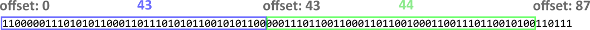
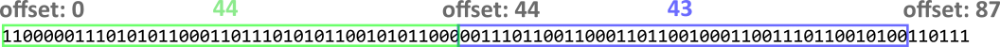

# Back to the roots

## Description

We are given 2 files
- a rust program containing the code to encrypt the flag, and
- the encrypted flag

## Columnar Transposition Cipher

The code is not difficult to read, it implements the [Columnar Transposition Cipher](https://en.wikipedia.org/wiki/Transposition_cipher#Columnar_transposition).

Here is a simple illustration of the cipher


## Challenge Constraints

1. The plaintext is of all lowercase letters -- the first three bits of every character is `011`
2. The key length is unknown, but is in the range [21, 35] inclusive.
3. The whole text is of length 1432 bits -- the length of flag = 1432 / 8 = 179 characters

## Solving the key length

With the pattern, we can illustrate the above example below.


We can see that there are restrictions on column bits positions. For a valid key length, each column pattern must exist in the encrypted output. With this criteria, we brute force all key lengths from 21 to 35 and found only 33 is a valid key length.

## Getting the column chunks offset in the encrypted text

This is the most challenging part. We now first redraw the patterns.


There are several observations (thus requirements):
1. There are only 8 distinct column patterns, labeled with ID `0` to `7`, `0` occurs 5 times while all others occur 4 times.
2. Column chunks are either of length 43 or 44.
3. For 44-length chunks, there are exactly 2 occurences of pattern ids `0` to `4`, but only 1 occurence of pattern ids `5` to `7`.
4. For 44-length chunks where their pattern IDs are `5`, `6` or `7`, the extra 44-th bit is also restricted to be `0`, `1` and `1` respectively.

It is important to recover how the 44-length and 43-length chunks align, i.e. how are the green and blue chunks arranged in the entire encrypted text.

Is it starting with this:



or this?



or both blue (43) chunks? or both green (44) chunks?

To solve it, we try to find for each offset whether it is a possible beginning of a column chunk by checking if we could get the possible matched pattern ID, e.g. for the chunk beginning at index 0, the matched pattern ID is `2`; at index 1, the matched pattern ID is `3`; but at index 7, there is no matched pattern, meaning the column chunks must not begin at index 7.

Then we could use any search algorithm to look for possible candidates. For simplicity I used `networkx` library to create a graph network and genereate all paths candidates.

Below is a sample of the graph edges, connecting 2 neighbouring chunks' beginning index. The pattern ID is for reference only. From this, we could quickly spot that the first 3 nodes must be `[0, 43, 86]`.
```
(0, 43)    # pattern ID: 2
(39, 82)   # pattern ID: 2
(39, 83)   # pattern ID: 2
(40, 83)   # pattern ID: 3
(40, 84)   # pattern ID: 3
(41, 84)   # pattern ID: 4
(41, 85)   # pattern ID: 4
(42, 85)   # pattern ID: 5
(42, 86)   # pattern ID: 5
(43, 86)   # pattern ID: 6
(81, 124)  # pattern ID: 3
(81, 125)  # pattern ID: 3
(82, 125)  # pattern ID: 4
(82, 126)  # pattern ID: 4
(83, 126)  # pattern ID: 5
```

We get all possible paths connecting `0` to `1432`, i.e. the end of the text. For each path, we validate them if they satisfy the above 4 requirements. There are now only 2 path candidates remaining.
```
[0, 43, 86, 129, 173, 217, 261, 304, 348, 391, 434, 477, 520, 564, 607, 651, 694, 737, 781, 824, 867, 910, 953, 997, 1040, 1084, 1128, 1171, 1215, 1259, 1302, 1346, 1389, 1432]   # this is the correct one

[0, 43, 86, 130, 173, 217, 261, 304, 348, 391, 434, 477, 520, 564, 607, 650, 694, 737, 781, 824, 867, 910, 954, 997, 1040, 1084, 1128, 1171, 1215, 1259, 1302, 1345, 1389, 1432]
```

## Permutate the column chunks to recover the flag

Finally, loop both path candidates, permutate all possible chunk orders, and finally check which one gives a flag with all lowercase letters. DONE!