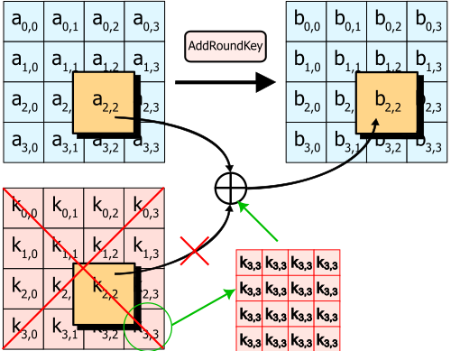
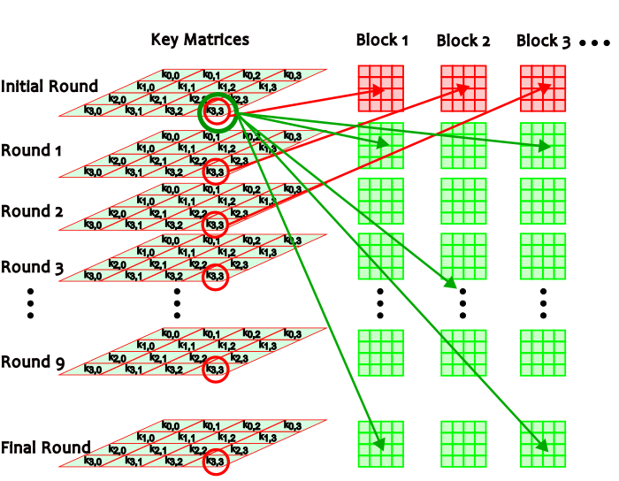

# Mystiz Can't Code
## Quick Glance
As the challenge stated, it is a batch implementation of AES encryption with some unknown bugs. The batch file is given with a `transcript.txt` containing a sample encrypted result of two plaintexts: `b'hello world!'` and the flag, using a same unknown key.
```
C:\Users\mystiz>aes.bat [**REDACTED_KEY**] 68656c6c6f20776f726c6421
2740f489df8449453fd87f075a648e94

C:\Users\mystiz>aes.bat [**REDACTED_KEY**] [**REDACTED_FLAG**]
9a3538b25faf70f2654e7816df540acedb753d319f76311d95a4ad5e797fff3e13f7dcbde563baf8f7ac62580196b5ca911789fedade0fd6fb40642413d521992311f9bc01d127db4bbcf257ee5deb8fcd49b23aadd12f52fa7829e7e281373f
```

In the first example the plaintext is only of 12 bytes long but the ciphertext is of 16 bytes, suggesting it should be a 128-bit AES. And that the trivial way to solve this challange is to debug the batch implementation and see what happens next.

## Starting the Debug
Since I am totally new to batch script, I could not read the code easily. Therefore I decided to find a [python implementation of the AES](https://github.com/boppreh/aes/blob/master/aes.py) with different modes to do the debugging in parallel. Using the given `hello world!` plaintext, I ran both the python and batch scripts with a dummy key `12345678901234567890123456789012` to print the intermediate outputs and checked for any discrepancies.

## Debugging Result
I found the bug is within the `Add-Round-Key` operation. The `xor` operation of AES encryption is supposed to use all the 16 elements of the key matrix of the specified round, but in the first block of the batch implementation it always used only the last element of the key matrix.


The batch code bug is as below and so I modified the python code for both the encryption and decryption functions.

### Batch Code:
```bat
:AddRoundKey
    set round_id=%1
    for /l %%i in (0, 1, 15) do (
        rem bug: j is always 15 in the first block
        set /a j=16*%round_id%+%%i
        set /a STATE[%%i]="STATE[%%i]^KEY[%j%]"
    )
exit /b 0
```

### Python Code:
```python
def encrypt_block(self, plaintext):
    """
    Encrypts a single block of 16 byte long plaintext.
    """
    assert len(plaintext) == 16

    plain_state = bytes2matrix(plaintext)

    #####################################################
    # correct code
    # add_round_key(plain_state, self._key_matrices[0])
    ###################### The Bug ######################
    val = self._key_matrices[0][3][3]
    self.m = [[val]*4 for _ in range(4)]
    add_round_key(plain_state, self.m)
    #####################################################

    for i in range(1, self.n_rounds):
        sub_bytes(plain_state)
        shift_rows(plain_state)
        mix_columns(plain_state)
        #####################################################
        # correct code
        # add_round_key(plain_state, self._key_matrices[i])
        ###################### The Bug ######################
        add_round_key(plain_state, self.m)
        #####################################################

    sub_bytes(plain_state)
    shift_rows(plain_state)
    #####################################################
    # correct code
    # add_round_key(plain_state, self._key_matrices[-1])
    ###################### The Bug ######################
    add_round_key(plain_state, self.m)
    #####################################################

    return matrix2bytes(plain_state)

def decrypt_block(self, ciphertext):
    """
    Decrypts a single block of 16 byte long ciphertext.
    """
    assert len(ciphertext) == 16

    cipher_state = bytes2matrix(ciphertext)

    #####################################################
    # correct code
    # add_round_key(cipher_state, self._key_matrices[-1])
    ###################### The Bug ######################
    add_round_key(cipher_state, self.m)
    #####################################################

    inv_shift_rows(cipher_state)
    inv_sub_bytes(cipher_state)

    for i in range(self.n_rounds - 1, 0, -1):
        #####################################################
        # correct code
        # add_round_key(cipher_state, self._key_matrices[i])
        ###################### The Bug ######################
        add_round_key(cipher_state, self.m)
        #####################################################
        inv_mix_columns(cipher_state)
        inv_shift_rows(cipher_state)
        inv_sub_bytes(cipher_state)

    #####################################################
    # correct code
    # add_round_key(cipher_state, self._key_matrices[0])
    ###################### The Bug ######################
    add_round_key(cipher_state, self.m)
    #####################################################
```

## Plaintext Recovery
At this point since there is an internal calculation bug of the AES algorithm, I tend to think I can brute force the key to recover the flag. I tested which of the 16 bytes could change the ciphertext and found only the last byte has effect. A simple brute force recovers the first block of the flag with the code below. However I could not recover it from the 2nd block onwards.

```python
for i in range(256):
    key = bytes.fromhex('%032x' % i)
    aes = AES(key)
    res = aes.decrypt_block(long_to_bytes(0x9a3538b25faf70f2654e7816df540ace))
    if b'hkcert' in res:
        print(key.hex(), res)   # 00000000000000000000000000000023 b'hkcert22{pr09r4m'
```

## Further debugging
I took a longer plaintext and debugged again. Throughout reading the code, I do not think there is any reuse of ciphertext in previous rounds. Then I discovered the `Add Round Key` Operation didn't always get the last element of the first round key matrix. It actually behaves differently throughout the initial + 10 subsequent rounds.
- Initial Round: It uses the last element of the key matrix of the round key.
- Other rounds: It always use the last element of the first round key matrix.
I then modified the code slightly to cater for this logic, showing the encryption block only.



### Python Code
```python
def encrypt_block(self, plaintext, block_id=0):
    """
    Encrypts a single block of 16 byte long plaintext.
    """
    assert len(plaintext) == 16

    plain_state = bytes2matrix(plaintext)

    #####################################################
    # correct code
    # add_round_key(plain_state, self._key_matrices[0])
    ###################### The Bug ######################
    val = self._key_matrices[block_id][3][3]
    m_block = [[val]*4 for _ in range(4)]
    add_round_key(plain_state, m_block)
    #####################################################

    for i in range(1, self.n_rounds):
        sub_bytes(plain_state)
        shift_rows(plain_state)
        mix_columns(plain_state)
        #####################################################
        # correct code
        # add_round_key(plain_state, self._key_matrices[i])
        ###################### The Bug ######################
        # this loop-independent logic is put inside the loop
        # only for easier comparison
        val = self._key_matrices[0][3][3]
        bytes_val = long_to_bytes(val)*4
        self.m = [bytes_val] * 4
        add_round_key(plain_state, self.m)
        #####################################################

    sub_bytes(plain_state)
    shift_rows(plain_state)
    #####################################################
    # correct code
    # add_round_key(plain_state, self._key_matrices[-1])
    ###################### The Bug ######################
    add_round_key(plain_state, self.m)
    #####################################################

    return matrix2bytes(plain_state)
```

## Final Step: Finding the Flag
I proceeded to recover the flag, I found that in the 2nd block there are 5 bytes which change the ciphertext. Given this small number, I believe brute force still works.
One of the 5 bytes is the last byte, I believed it is not needed as it was used in the first block.
```python
ciphertext = long_to_bytes(0x9a3538b25faf70f2654e7816df540acedb753d319f76311d95a4ad5e797fff3e13f7dcbde563baf8f7ac62580196b5ca911789fedade0fd6fb40642413d521992311f9bc01d127db4bbcf257ee5deb8fcd49b23aadd12f52fa7829e7e281373f)
chars = '0123456789abcdef'
# pos of the key that could change the ciphertext: [6, 7, 14, 15, 22, 23, 24, 25, 30, 31]:
for r1 in chars:
    for r2 in chars:
        print('running', r2)
        for r3 in chars:
            for r4 in chars:
                for r5 in chars:
                    for r6 in chars:
                        for r7 in chars:
                            for r8 in chars:
                                key = '012345'+r1+r2+'890123'+r3+r4+'678901'+r5+r6+r7+r8+'6789'+'23'
                                aes = AES(bytearray.fromhex(key))
                                res1 = aes.decrypt_block(ciphertext[16:32], block_id=1)
                                if b'_' in res1:
                                    print(key, res1)

# 01234500890123006789010012678923 b'[\x07XQi_XiT\x02\x01U^i\x07E'
# 01234500890123006789010031678923 b'U\tV_gQVgZ\x0c\x0f[Pg\tK'
# 01234500890123006789010033678923 b'Q\rR[cURc^\x08\x0b_Tc\rO'
# 0123450089012300678901007d678923 b'm1ng_in_b47ch_1s'                     # <- flag
# 01234500890123006789010080678923 b'_\x03\\Um[\\mP\x06\x05QZm\x03A'
# 01234500890123006789010085678923 b'\x05Y\x06\x0f7\x01\x067\n\\_\x0b\x007Y\x1b'
# 012345008901230067890100a8678923 b'P\x0cSZbTSb_\t\n^Ub\x0cN'
# 012345008901230067890100a9678923 b'A\x1dBKsEBsN\x18\x1bODs\x1d_'
# 012345008901230067890100ac678923 b'\x03_\x00\t1\x07\x001\x0cZY\r\x061_\x1d'
# 012345008901230067890100b1678923 b'Z\x06YPh^YhU\x03\x00T_h\x06D'
# 012345008901230067890100e7678923 b'\x06Z\x05\x0c4\x02\x054\t_\\\x08\x034Z\x18'
# 012345008901230067890100ec678923 b'\\\x00_VnX_nS\x05\x06RYn\x00B'
# 0123450089012300678901010c678923 b'm1ng_in_b47ch_1s'                     # <- flag
# 01234500890123006789010112678923 b'Z\x06YPh^YhU\x03\x00T_h\x06D'
# 01234500890123006789010127678923 b'_\x03\\Um[\\mP\x06\x05QZm\x03A'

```

It looks like there are numerous keys which could decrypt the flag per block. So I went on decrypting each block individually, while trying to exclude the bytes position that have been used in previous blocks, and eventually got the flag: `hkcert22{pr09r4mm1ng_in_b47ch_1s_s0_d1fficul7_4nd_why_d03s_th1n9s_1n_br4ck3t_run5_in_p4ral13l}`.

## Final Words
At the time of writing, I still could not understand the bug of the batch implementation `j = 16 * round_id + i` while `i` did change inside the loop -- is there strange behaviour about loops in batch?

Update: [This link](https://stackoverflow.com/questions/13805187/how-to-set-a-variable-inside-a-loop-for-f) probably helps, indicating the code should:
- using `!j!` instead of `%j%`,
- there is something related to running things in parallel as the flag hinted.
