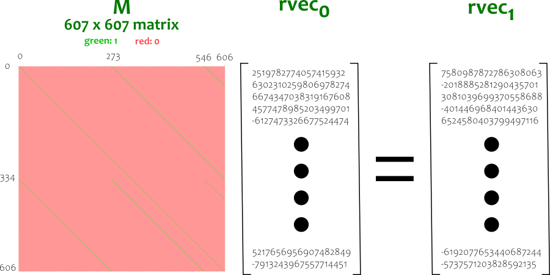

# Slow Keystream
## Background
I did not manage to solve this challenge during the competition, I only let the script run throughout the 2-day period and got the first 40 characters of the flag only. At that time my teammate found the random algorithm code for me but I did not dig in detail and think of way to skip the iteration.

Now the reason I retry this challenge is, when I joined another CTF competition recently, I encountered a linear congruential generator (LCG) which I thought about using matrix to solve (which is incorrect actually). Then I also recalled in the discord channel someone mentioned using matrix for this challenge, although there was not a proper write-up thread for this challenge in discord. So I decided to give it a try after that CTF competition, as a journey to try dealing with all crypto challenges in CTF!

## Quick Glance
There is a Golang script `flag.go` with its executable `flag` which reads the encrypted flag from `flag.enc` and decrypt the flag and print out to the console. By running, it starts to print the flag character by character, but it is getting slower and slower. After `hkcert22{y0u_c4n_n4vig4t3_r4nd0`, it starts to take minutes to get a single character, and obviously would take hours and subsequently days to complete. Therefore the goal is to shorten the decryption process.

## Reading the Golang code
```Go
for i, j := uint64(0), 0; j < len(flag); i++ {
    rand.Uint64()
    if i == uint64(1)<<j {
        x := byte(rand.Uint64())
        fmt.Print(string(flag[j] ^ x))
        j += 1
    }
}
```
The code is very short, only a loop to random numbers with the given seed `1337` to do xor-operations on the flag. The reason it takes so long is, it takes the approximately 2<sup>k</sup>-th random number to process for the `k`-th character of the flag. For instance, to decrypt the 40-th character of the flag, it takes 2<sup>40</sup>-th random numbers.

## Golang Random Algorithm
To shorten the time we need to understand the [Golang Random Algorithm](https://github.com/golang/go/blob/master/src/math/rand/rng.go) and try to skip the iteration.
```Go
// Seed uses the provided seed value to initialize the generator to a deterministic state.
func (rng *rngSource) Seed(seed int64) {
    rng.tap = 0
    rng.feed = rngLen - rngTap  // rngLen = 607

    seed = seed % int32max
    if seed < 0 {
        seed += int32max
    }
    if seed == 0 {
        seed = 89482311
    }

    x := int32(seed)
    for i := -20; i < rngLen; i++ {   // rngLen = 607
        x = seedrand(x)
        if i >= 0 {
            var u int64
            u = int64(x) << 40
            x = seedrand(x)
            u ^= int64(x) << 20
            x = seedrand(x)
            u ^= int64(x)
            u ^= rngCooked[i]
            rng.vec[i] = u
        }
    }
}

// Uint64 returns a non-negative pseudo-random 64-bit integer as an uint64.
func (rng *rngSource) Uint64() uint64 {
    rng.tap--
    if rng.tap < 0 {
        rng.tap += rngLen
    }

    rng.feed--
    if rng.feed < 0 {
        rng.feed += rngLen
    }

    x := rng.vec[rng.feed] + rng.vec[rng.tap]
    rng.vec[rng.feed] = x
    return uint64(x)
}
```
By the Seed function we could extract the initial random state `rng.vec`. For the `rand.Uint64` function, it is doing addition of the `rng.vec` iteratively. To speed up this it looks like creating a matrix `M` s.t. rvec<sub>n+1</sub> = M * rvec<sub>n</sub> will work. Then to find the `n+1`-th random number, we find the rvec array rvec<sub>(n // rngLen) + 1</sub>, which is M<sup>(n // rngLen) + 1</sup> * rvec<sub>0</sub>

## Analyzing the Random Algorithm
From the source code we could find `rngLen = 607` and `rngTap = 273`, where initial values `rng.tap = 0` and `rng.feed = rngLen - rngTap = 334`, we now check with a cycle of 607 iterations how the `rng.vec` changes.


## Building the Matrix
Simply build the matrix as below, where rvec<sub>n</sub> = M<sup>n</sup> rvec<sub>0</sub>



## Getting the flag
It now only takes around 6 minutes to complete the decryption process. Yay.

During writing this code, I spent some time to figure out what's wrong with the seemingly obviously correct code `flag += xor(flag_enc[i], num % 256)`. I didn't expect the modulus would give error as mentioned in this thread so I was very suprised when I saw `int(np.uint64(3850181338984981652)) % 256` gives the correct value 148 but `np.uint64(3850181338984981652) % 256` gives `0.0`. This bug is still open as this [issue(https://github.com/numpy/numpy/issues/12525)]. Overall this challenge isn't that difficult for me....well...
```Python
import numpy as np
from pwn import xor

with open('flag.enc', 'rb') as f:
    flag_enc = f.read()

def get_matrix():

    mat = []

    for i in range(61):
        pos = [j % 607 for j in [i, i+273, i+273*2]]
        arr = np.zeros((607))
        arr[pos] = 1
        mat.append(arr)

    for i in range(61, 334):
        pos = [j % 607 for j in [i, i+273]]
        arr = np.zeros((607))
        arr[pos] = 1
        mat.append(arr)

    for i in range(334, 395):
        pos = [j % 607 for j in [i, i+273, i+273*2, i+273*3]]
        arr = np.zeros((607))
        arr[pos] = 1
        mat.append(arr)

    for i in range(395, 607):
        pos = [j % 607 for j in [i, i+273, i+273*2]]
        arr = np.zeros((607))
        arr[pos] = 1
        mat.append(arr)

    mat = np.array(mat, dtype=np.int64)

    return mat

def calc_block_and_idx(pos):
    block_idx = pos // 607
    raw_idx = pos % 607
    idx = (333 - raw_idx) % 607
    return (block_idx, idx)

def get_all_pos():
    # get no. of iterations required for each character of flag
    required_pos = [2**i+1 for i in range(63)]
    all_pos = []
    s = 0
    for p in required_pos:
        s += p
        all_pos.append(s+2)
    all_pos = [2] + all_pos
    return all_pos

rvec = np.array([
    2519782774057415932, 6302310259806978274, 6674347038319167608, 4577478985203499701, -6127473326677524474, -1328539327532347105, 6115109129563223101, 7514263535335994195, 2613063542706161016, -5692843610920622673, -6777455907387513424, 7563376961609327342, -2968730448970493822, 4676027705253451887, -7057239042411458217, 6487007572163158722, -7839572830956174846, 9116205777969866695, 3269074615096678283, 1690447351569387200, 7534636651789398558, 1640230976783948815, 1371640557138133309, 5318053144869862604, 775811637752690131, -7851193424302090760, -4688042990777483506, 4294812266342945472, -1374069837736950865, 4235300200976319794, -8643381454611066863, 4311218858691584305, -444231825053902897, -6119601920736843959, -2977583512665387498, 5339755667719218841, 738789385636012056, -27790548649618583, 933302201117230296, -3127742203451833188, -3028770291155480976, 7463774859678230719, 6239931410685582975, -5392712427099621124, -3166489558654050074, 448034055216855288, 6926600023831806202, 3007407808525469115, -6761853083603539793, -5866555852505472130, -9084980005622749331, -2074998130914236683, 3648104770453395112, 3471522194178593557, 5251287528204134811, 7818992543928466753, -5007424397650487140, 5932017993506103914, -5986999168180273504, 5000077073740048326, -8942222879775382488, -5509067416474346009, -2004279053541286313, -6062220250858641727, -8878550486295914759, 521126373157966526, 6251342669657357803, 3020681108835367696, 530766244860661052, 2129125889423984555, 7467612847193709379, 6134636394969836926, 3237781729386482594, -2295924288919284226, 1995153279940534258, -4125059723087411988, -3968539809383276834, -7637044552251247689, 3624434501226490272, 4011022533490865720, 2849525385593382405, -1245319552342327127, 864809933203657777, -5518770047016583356, -573940299423225464, -474229169665452894, 7238133670523032438, -717073013050730485, 9023605712601576543, -2632029750862601179, -946400155765401582, -79302808625110562, 4704175247335050939, -6908503266202111053, 1102413731565085568, 3745569135214571018, 6153716416487780925, -6753652885127509403, 7177606433241126916, 4750147851257651038, -664269931795332474, 878100769568201407, 320771889712988259, 747832212551314917, -3329069360532827708, 1999417066332545809, -5313887922040554950, 3122388651305161946, -7284474580579336221, 4994689787142432866, -5855904686067131482, 7486734309532356723, -834501474289106848, -3883672262855334876, -6213410554960319864, 610947113229713604, 5185758133775422480, 2781917394255794095, 1815062614194809173, 5080998196317525653, -1364322223054971208, -9096837110376670165, -8174177618338108927, 2758974498343753192, -3487210254705726640, -1295328290426530650, 5265327288024738086, -7931330341446870768, 5579792373059410851, 7959455578893521195, -5003178986013819680, -5328175405118959666, 8558919472340787939, 6975936587732587535, -2684970405762668245, -5350992224650622337, 8117242728718619425, -112924639568235362, -3574738294306684808, -2586461513293448510, 1002653356852923492, 3277714689015635020, 1732072918916665147, -8486732797144065348, -8612761484867242853, -5836043219553948815, 1371352735694803577, 2241872963274413726, 6535296110708724300, -2975530368800664306, 3165261164113701520, 4705897013193863088, -6423484607876821495, 8582784503908060053, -7293182692992185975, -1952976992281340901, 7894441245077700854, -3338491407268386932, -7689439148978071671, 2996904379221385095, 2215066023979644617, -4462281995935448004, 1552215638980646699, -3332721310293942841, -315564041025528174, 1257679856365878159, -3516754321575107917, 5246092152794084172, 3395541083741749669, 5437408163365238240, 763282065188584395, 7851707945678302369, 8335547719206228687, 8779042184902105642, 2957377826054287991, 3461100384567397250, 2398109799455376922, -5740123606534412029, -4135831853530297667, -2657965531857149649, 7939690495834355015, -4334208240761564864, -5050404347007710366, -4945035488148429594, -1789447479105996557, -6932469990615556846, 2240661041075183778, 1174227287170577483, 5924338098790867595, 1347982184386958425, 9143321882709636092, -1543254073199472464, -5750074000120156755, -6520770368865451478, -7983405893080047922, -8246539572235723125, -3111336366623131482, 6892143683614596910, -3560726763756607392, -46475889807413035, -8651811199051875390, -2892223835365959, -5483460686573922632, -4189723190193955982, 5207358042787497393, 7621064322011313837, -2862666066684166305, 8726355674778168299, 9078677025865963021, -1393224121229175031, 4501054158258721677, -2900038694940232234, -5135315152892664189, -8357625262086919078, 6024096860408421513, 8649938182775964090, 5487831587447209850, -7281435883651849799, -6455773951744978170, 4556678491336293058, 2018280386672471725, -7794212753505237723, 7018768397716485049, 4939179962495090144, 3623211405438050987, -4820127228246789582, 875216268501199367, -4178908678951183853, -2027746803750366971, 253413158878450515, -6260873589881481973, 2450626567368767992, 5416835795252489619, 5243641996545080971, -5417536946231671047, 7026772916200857143, -377385467691992701, -1234885493629103813, 6382429234979381625, -2997920173446980549, -6379186332447530664, 2547748602884778436, 9150133074137940294, 4362679204031990469, 1713728805153810174, 728030298357779031, 7197480704329136939, -1181317683172904783, -1845640045882982773, -1871530697969895436, -8290226921736085962, 5408352522575413654, 1529425670353760955, 317157192371190725, -1094835118240603285, -4143152761290462743, -1929297789426889089, 7415209425309381485, 4402792052137505699, -5336269551932731288, 4135312495950279995, 572403909643553048, 9057875564206009908, 2627152241015180303, 1282299659768146084, 7638421797555290021, 7798397591382631043, 7322125526913954921, -6039073227583018640, 7377693044081717045, -4204949368079548923, 2357036460568678838, -7565596718189730245, 8808853938930676752, -7614957395635972681, -608871825726409831, -8423241592238950255, 2594472225891570274, 4060006339424460517, -8491584921791849739, -2374285988213732909, -5785263910739218060, -7821368675250625849, -7480837946081149606, 6245933963861817368, 687641150623454134, -7513228888763812040, 538734059338601351, 2277778710708257780, 2514614769845673970, -2099269865616354978, 3494044974989950292, 4326933212587498731, 7662786463313496736, 789215692155698118, -6035792667389244897, -6637422051023595660, 7564686238800793636, 5393103900884107499, -3055047002839709803, -575748396089185263, -6605596557904559948, -3107264042787784399, -4878443375417160201, 8103936154558109947, 6747953945828221304, -3185655812444476203, -8163493500823727881, -3732178609838253175, -2591397199508488181, 828292809182288139, -6580597352065432016, -1425338879619505263, -4367040824074524124, -6928905550140601217, -5372510452019418905, -3653698604373056360, -215442627675112238, -1994106264860552970, 144823316686964660, -3147141204263358308, -1849910167968368156, 3836699607358291753, -2239696591065234260, -531031312970561233, 5691945723079217250, 5574735044444411666, -3655733177419808893, -5531407987265545963, -38724260348199088, -2442596701657447014, 3730288335099527662, 7162089461175879265, 4488961418697934649, -8226866480839707887, 4243295907849992733, 4378586512104843483, -6438462248134936998, 3425100566317440401, 7091029890524425674, 8547579154629395206, 5416097761969607537, 3127625445136194240, -2318020196733170922, -4592429154105936676, 2794404151599799542, -6281302541359565693, 738392411338990486, 7163146362433689786, 3133862245565837054, -4021312337205970847, -8082598484831188876, -5197116093478768375, -5817128497182460498, -6710188739594998790, -1822049473750744136, 2731662657622503513, -5142146732652853560, 4489979258982057143, -6217104362555059537, -4754613037247216216, 6353354396737820579, 5478437665929919927, 1217293032820674255, 2011282925301856213, 2657897250301316112, 8922492038678070472, -3202445774760676652, 7456211681601419064, -4726341387472424072, -4125719805310693095, -5382054788567730083, -3563575247246114264, -6632783003008983241, -2843542579931546423, -2274926141918415924, -4137894489240269729, -5661659990218042713, 4846666620436221810, 7471965168347457689, 1295754981063085168, 422720578208793755, 6866997698616323062, 7799333927669193011, -1113626161142616014, -1821947926887347943, -874133310884864957, 187618801346795791, 6549361350890961361, -7071918590963648631, 7844199281625946782, 2359431063306578000, -2600483912788062083, -2136712660437093312, -3375053303776916240, 8889328354576954823, 7618065966655040714, 7285321419586294327, 4137943609669688705, -1537188679733135432, 8876644014132375003, 4918088234582732949, 8481741392225598012, 2832019066640402142, -8326585614521719316, -6597888161988990105, 3747419739710415752, 420514572652161409, 517723111198640160, 3656105894945988005, -8805925849515891902, 1213807074558117718, 480154757162308404, 8317026672263851587, 2841286507522052589, -3818640368692495045, -2118011078865181926, -8374487718877256875, 3892360030500013731, -2612068345865083249, 7333178991082239109, -7404657119353789824, -3345992803405622500, 7674116337951395214, -6364975390632638672, 8117867828035094752, -1993266467122961694, 4765999251690358981, -8115482541393444018, -7264406035210104735, -8149847153398700167, 4135273871586579508, -8555089924216483916, 704566187997603392, 4591618584092697895, 8709392905253835505, -1161639423439310050, 2074268989340873484, 453754768828599976, 6415906355622701200, 5520204474003843546, -1048217484936781836, 5867100662413990347, -4951488519776278416, -4745108709368783490, 846495727899396645, -1793074312508635959, 175579344373449141, -3963955422499638356, 6460062049974479136, -3920382580376853180, 148906520254988189, -3669646497442202090, -1137588018386208994, -9162149665164904335, -7128357137419915536, -4782916471256891043, 6199439145731521528, 1608727961360256641, -1311624513360446555, 5390830917151141188, 8363166261842064003, -8987530086482295353, -1415536926771319737, 6450098413061329845, -8018316566095714651, -4617500963122090164, -3226625953597269064, -3430401047409192815, 2660042656743466303, -3530370203190732289, 1180973230405951181, 9090708336182467180, 1330374913385251853, -1952078862414905519, -4928446977264965468, 4100188218862716922, 2011843992429063817, 7010694368247917025, -6494151387118846669, 6594928232594931975, 8708741814486875310, 6478367035965774587, -2433899971197326945, -6870201487082744578, 2331092992093074908, -6995258035906467598, -1241217534967000783, 8767470138108595028, -296534331641171836, 7948073744585566962, 2466226421731300860, -6420258284869978597, 8682071264399524460, 1066103345970643014, 7483805290750407021, 8959444951264293187, -4176843006858123969, -8545223544930188224, 5275865594221430661, -1047412832430778268, -221919090186463723, 5636076909533768441, 8507667887272926927, 788603573420515859, -5371110107246015310, 9024379513675917634, 7721150329123845125, 7666257973553238062, 5526198346443037605, -1286155275095120279, 7780404048658085294, -977310446518581495, -8547962552472840783, -8528449267229927128, -1249154700949408167, 2955803531812845056, 3027788987412090168, -7121252237868902853, 1891477610153919028, -2386235034111433155, -7496215427916620327, -262042015847031182, -9031895088350846911, -3728154571972705704, -3384343149239974996, -5879079236341857843, -7496718291293109053, -4687846255070436467, -8654694912131143539, 515942429600611106, -8502599227284486105, -2628420452910573659, -6707977389695896519, -3142862861697154646, 2100719959795443907, 7372749642814249472, 8255609213528340735, 5609842118329547501, 8893075972780157345, -8810535964604292398, -7594834366869668423, 8567991146472165452, -2611031041034365736, 4679973002792702685, -8705474591790699055, -3747648840201784621, -706238145461441294, -2984435513222199089, 3444315638634006924, -8389162569124100300, 2266071416950108763, 7186510839504508127, 3860498370794119994, -9078347643344563931, 1689107175131540532, 2675720504027212765, 3662052106537287364, 425297427631753064, -5106816138905307580, 3692495725726870678, -5219907434688738204, 5268689424766918991, -1397251916214671939, -7162937011205228965, 5709106544282814675, 7784583735242177608, -4646566048961988574, 1602601593113041407, 3128382388399256875, -4072380863483384762, -3764780967825423195, -3278557616364921438, -8012839556039420705, 4506076805561233658, 4957122625880138122, 8197113518206511101, 3000256255238694312, -9006504659559951450, 9200248604193479070, 9069092102292417042, -5062675432433761432, -13542240881414853, -3467001786775287662, -7696700908239440964, -2310681426256732306, 6660175970718503382, -8461990629455867675, -4915184754643334370, -4025703493675783905, 7990143739042046958, -9081241054396910947, -3770345310872172066, -4380816717995316361, 3864063186247759472, -9159687863526988706, 6343857777180154516, -8918927299489663050, -6357158265428346414, -6985156464132452619, -290889737929565745, 2441376156857036312, 8233542976852826496, 2076693848773569769, 119893003885453990, 5217656956907482849, -7913243967557714451
], dtype = np.int64)

flag = b''
mat = get_matrix()
all_pos = get_all_pos()

for i, p in enumerate(all_pos):
    block_idx, pos_idx = calc_block_and_idx(p)
    print('processing:', i, 'block_idx (required matrix power):', block_idx)
    num = np.uint64(np.dot(np.linalg.matrix_power(mat, block_idx+1), rvec)[pos_idx])
    flag += xor(flag_enc[i], int(num) % 256)

print(flag)
```