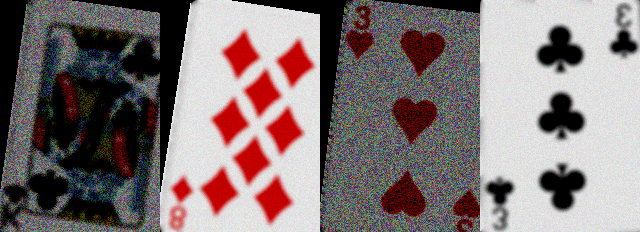
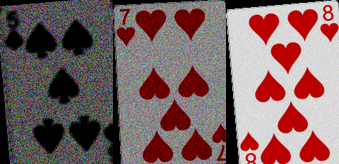
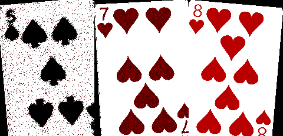
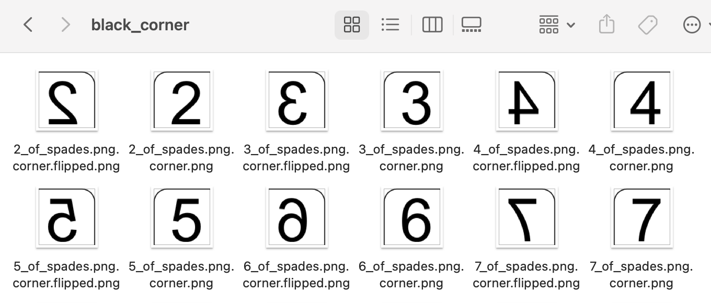
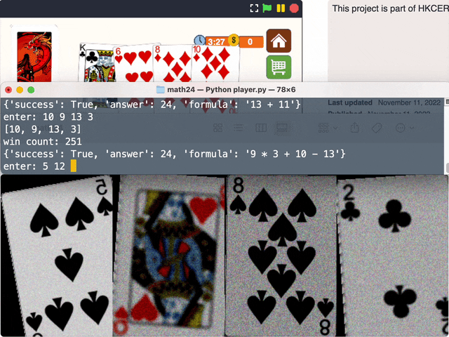

# The Math24 Game 2 雷生春堂

## Objective

While in game 1 we were only required to craft one flag, in game 2 both a flag and a pole were required.

If we played the game for real, we would need 2700 coins to achieve that.

## What we learned from Game 1

- snap game
- HTTP Requests involved
    - `gameNew`
    - `gameAnswer`

## Whether the methodology from Game 1 applies to Game 2?

- mathematically not working
- the category of the challenge is misc, not web

## First try

With a standard deck of cards, there would only be 52 cards, if we could retrieve the image, we can identify which card were provided. With a game24 solver, the game could be solved quickly.

(TODO: insert images)

Therefore I started parsing the images, recognizing it, and sending back the results to the server.

- how an image is represented
- hash it ("rainbow table")

## The obstacle appears

The script was running quickly and smoothly.

While we thought we have completed the challenge, the script failed at the 102th game, where I got 1010 coins.

Going back to the snap game, I saw the card images changed: they became blurred, with noises, rotated and sometimes flipped. It was an additional card set not encountered before.

## Experiment 1 - Machine learning

The first thought that came into my mind is machine learning.

Given that I didn't have much knowledge about the concrete and detailed implementation of machine learning, I experimented a little bit with tensorflow with existing trained dataset, but didn't manage to get any meaningful results.

## Experiment 2 - OCR

Since the numbers (or characters) were what we need, I turned my thought to OCR. I experimented with Tesseract. Directly running `pyTesseract` did not work for the images due to the noises, therefore I experimented with noise cleaning to improve the results:

Raw images:

Cleaned images:

While it successfully detected easy cases, it still did not work out for most of the other cases.

## Experiment 3 - Matching corner image pattern

Since the image source is essentially the same set as mentioned in the credits page of the game, I turned to the idea to match the corner part of the image manually.

With the cleaned images, I could try to match it with the different card corners to find the closest match, considering rotation and flipping.

However, a quick test showed that the parsing speed would be too slow (slower than playing by hand).

## Ready to give up

With all the hours I spent struggling with this challenge, I was ready to give up, so I went to bed.

The next day I woke up, I still wanted to complete it. And I started to think of other ways (aka more stupid ways) to complete it.

## Experiment 4 - Building a larger rainbow hash

While my friend inserted around 150 hashes of the new set of cards, I hoped to explore the possibility to record a significant enough portion of the card deck.

Although some of the cards were not in the hash, I could enter it on the fly and had the script saved the new hash. If I was lucky, I might be able to enter half of the cards for a sufficiently fast game-playing speed.

The results?

- The amount of hashes growed quickly, with most of the cards still unrecognized at the 800 mark, implying that there were hardly duplicates. The card set seemed to be huge.
- This was the first time I tried this method. Although this had proved that the hash method did not work, I observed that I still got over 2300 coins at the end of the 15 minutes. I even spent some time debugging the program when the script encountered error upon the 102th game!

Why not speed up this manual recognition process to get to 2700 coins?

## Final experiment - "image recognition" done in real time by human

I did two improvements:

1. Previously the manual recognition operated on a card-by-card basis. When a card was not recognized, it (only one card) showed up on my screen, and I entered the value of that card. Given that the hash method had been proved not working, I could instead show all the 4 cards on the screen at once, such that I could enter the 4 numbers in one go. It would a) eliminate the refreshing time, and b) reduce the human card parsing and typing time by processing as batches of 4 cards.

2. While still not too convinced (aka lazy) to find and implement a complete 24 solver, I went on to add a few more formula on solving to increase the chance to find a 24 solution. (In case it failed and I got close to 2700 coins, I could still improve the 24 solver by implementing a complete one)

I also calculated the required speed for this method:
- First 100 games require 1.5 to 2 minutes
- With 13 minutes left, we need to solve 170 more games, it means that on average one win is required per 13 * 60 / 170 = 4.5 seconds

Let's start:

(This was my other try after the contest. I could reliably got over 2700 coins within the time limit despite it's not easy.)

During the contest, I got 2900 coins when there were 30 seconds left. I was so excited and I went to the shop and crafted for the flag.

For me, it became a visual recognition and a typing speed test, on top of some HTTP request handling, image parsing/displaying, and a simple naive "game 24" solver.

Machine-learning assisted? Wahaha! I didn't use ML.

## Post mortem?

I didn't believe it is the intended solution because the timing is tight, and it was like doing the recognition manually, utilizing my visual recognition and typing speed.

I was a little bit shocked when I heard that machine learning was the intended solution. It simply showed that I am still a novice ctf player.

And it is time to learn more about machine learning.
