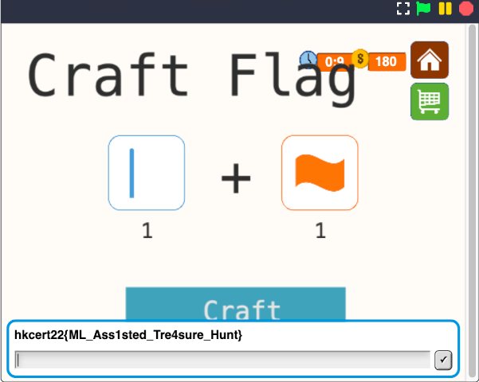

# The Math24 Game 2

## Objective

While in game 1 I was only required to craft one flag, in game 2 both a flag and a pole were required.

If I played the game for real, we would need 2700 coins to achieve that.

Playing it manually on snap was obviously infeasible.

I also learned from game 1 about the HTTP requests to and from the API server for the interactions of the games.
That meant it would be possible to play the game from scripts instead of from the GUI.

## The warm-up stage

Math24 is hosted on UCB's Snap platform, fork of MIT's Scratch. Upon looking at the traffic, and the type of image resources were downloaded, I was surprised that I didn't have any images nor values related to the cards downloaded. At closer examination, I realized that the `deck` in the API response was actually containing the images of the playing cards instead.

The `deck` seems to have dimensions of 4x37120x4. I figured out it would be a set of 4 cards, with 37120 pixels, and their RGBA values provided.

What I did that time was to use a hash to identify each playing card I saw, and I wrote a simple script to automate the play. At our naïveté, I wrote a script to loop through around 70 of the games to download their deck. For each unique card signature, I used the top left part of the card to compute a SHA256 signature to store within a hash dictionary, manually identify the card, in order to populate the dirty little hash dictionary.

A card sample:

The top-left part extracted for hashing:

By using a simple script to play my hands, I breezed through the first 1000 points, nice and simple.

But that was where it really got started.

## The obstacle appeared

The script failed at the 102th game, where I got 1010 coins.

Going back to the snap game, we saw the card images changed: they became blurred, with noises, rotated and sometimes flipped. It was an additional card set not encountered before.

The hash no longer worked because it appeared to have many different images: 150 more hashes were added but hardly any duplicates were found.

Since this challenge was labelled as a "misc" challenge, not a "web" challenge, we tried to find ways to identify the card value.

## Experiment 1 - Machine learning

The first thought that came into our mind is machine learning.

Given that I didn't have much knowledge about the concrete and detailed implementation of machine learning, I experimented a little bit with tensorflow with existing trained dataset, but didn't manage to get any meaningful results.

## Experiment 2 - OCR

As the numbers (or characters) were what we need, I turned my thought to OCR. I experimented with Tesseract. Directly running `pyTesseract` did not work for the images due to the noises, therefore I experimented with noise cleaning to improve the results:

Raw images:

Cleaned images:

While it successfully detected easy cases, it still did not work out for most of the other cases.

## Experiment 3 - Matching corner image pattern

Given the image source is essentially the same set as mentioned in the credits page of the game, I then tried to match the corner part of the image manually.

With the cleaned images, I could try to match it with the different card corners to find the closest match, considering rotation and flipping.

However, a quick test showed that the parsing speed would be too slow (slower than playing the game by hand).

## Ready to give up

With all the hours I spent struggling with this challenge, I was ready to give up, so I went to bed.

The next day I woke up, I still wanted to complete it. And I started to think of other ways (aka more stupid ways) to complete it.

## Experiment 4 - Building a larger hash table

While my friend inserted around 150 hashes (before giving up) of the new set of cards, I hoped to explore the possibility to record a significant enough portion of the card deck.

Although some of the cards were not in the hash, I could enter it on the fly and had the script saved the new hash. If I was lucky, I might be able to enter half of the cards for a sufficiently fast game-playing speed.

The results?

- The amount of hashes growed quickly, with most of the cards still unrecognized at the 800 mark, implying that there were hardly duplicates. The card set seemed to be huge.
- This was the first time I tried this method. Although this had proved that the hash method did not work, I observed that I still got over 2300 coins at the end of the 15 minutes. I even spent some time debugging the program when the script encountered error upon the 102th game!

Why not speed up this manual recognition process to get to 2700 coins?

## Final experiment - "image recognition" done in real time by human

I did two improvements:

1. Previously the manual recognition operated on a card-by-card basis. When a card was not recognized, it (only one card) showed up on my screen, and I entered the value of that card. Given that the hash method had been proved not working, I could instead show all the 4 cards on the screen at once, such that I could enter the 4 numbers in one go. It would a) eliminate the refreshing time, and b) reduce the human card parsing and typing time by processing as batches of 4 cards.

2. While still not too convinced (aka lazy) to find and implement a complete 24 solver, I went on to add a few more formula on solving to increase the chance to find a 24 solution. (In case it failed and I got close to 2700 coins, I could still improve the 24 solver by implementing a complete one)

I also calculated the required speed for this method so I could have an idea about how fast I needed to be:
- First 100 games require 1.5 to 2 minutes
- With 13 minutes left, we need to solve 170 more games, it means that on average one win is required per 13 * 60 / 170 = 4.5 seconds

Let's start:

(This was my other try after the contest. I could reliably got over 2700 coins within the time limit, thank to the author `@apple` for not making this game too hard!)

During the contest, I got 2900 coins when there were 30 seconds left. I was so excited and I went to the shop and crafted for the flag.

Machine-learning-assisted treasure hunt? Wahaha! I didn't use ML...

## Final Words

This challenge became a visual recognition and a typing speed test for me, on top of some HTTP request handling, image parsing/displaying, and a simple naive "game 24" solver. I didn't believe this was the intended solution because the timing was tight.

I might be the only one to solve this challenge without machine learning. When I heard after the CTF ended that machine learning was the intended solution, I knew it is time for me to learn about it in more details.
