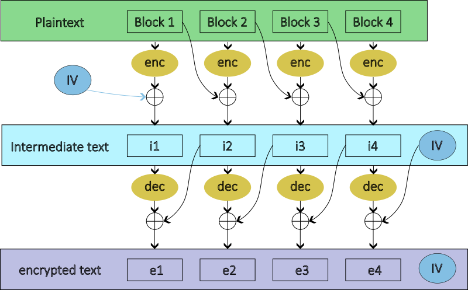

# Cleithrophobia

## Quick Glance
It is an customized encryption service which makes use of AES encryption and decryption processes. We can get the encrypted flag when the server starts, at the same time we can input any plaintext to the server and get the encrypted output.

## Overall Encryption structure
The first step is probably understanding the encryption process. From the given python file we get this with several points to note below:

1. The `enc` and `dec` mean using `AES (ECB mode)` encryption and decryption to the input block.
2. The key used in `AES` is the same within a session, which is unknown.
3. The random `IV` is different for every encryption, but it is known as it is padded at the end of the encrypted text from the server

## Getting AES Encryption & Decryption Result
A good step is to see if we can use the unknown key to encrypt and decrypt any text we want. Since there is `XOR` operations, it will be good to make use of `0` as plaintext to see what happens together with a target text. We can find it is easy to get the `AES` encrypted text (`RED` blocks). The `PINK` blocks are crucial to help in the process.

Moreover perhaps it is useful to get the encrypted text of a zero hexadecimal? It is easily found by simply inputting a lot of `0` blocks to the encryption service and I am not showing it here.

Similarly, to get an `AES` decrypted text, we work as below. The logic behind is to get `t` in the intermediate blocks knowing only `enc(0)`. Working backward from the intermediate block we know we need to input `t ^ enc(0)` as a plaintext block.
Finally we can get the `dec(t)` by doing XOR with `enc(0)`, i.e. `dec(t) = ( dec(t) ^ enc(0) ) ^ enc(0)`.

## Getting the flag
Since now we can use the unknown `AES` key to encrypt or decrypt any text, it is straightforward to workout the decryption of this service. Below uses 4 blocks as an example. Yay.

