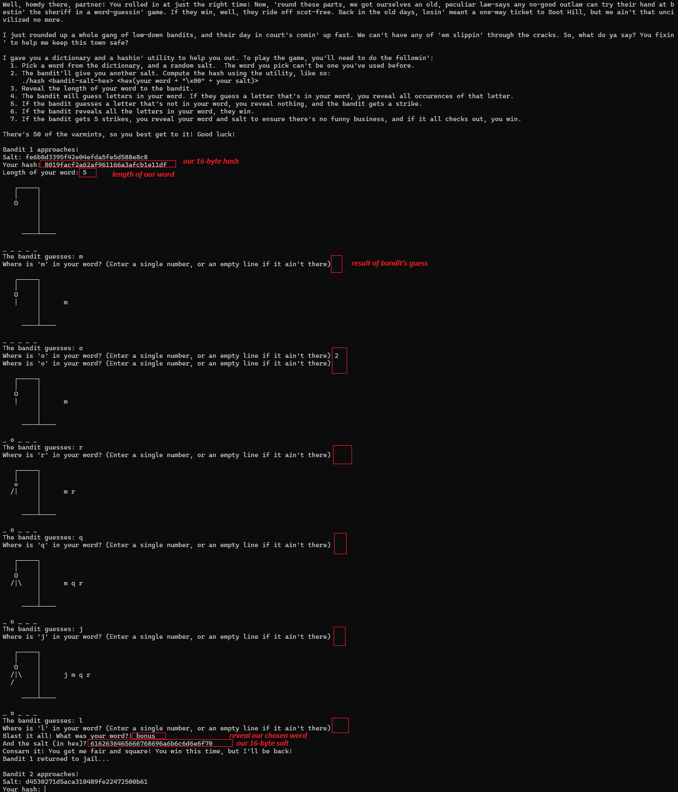

# Hangman

## Description

There are Part 1 & 2 to this challenge, labelled Misc, Rev and Crypto categories. This writeup focuses on Part 1 only.

This is a classic hangman game with the given dictionary file. Our role is to choose a valid word from the dictionary and let the "bandbit" guess our word.
For part 1, the bandbit needs to play ` 50` rounds and has ` 5` incorrect guesses per round.
For part 2, the bandbit needs to play `100` rounds and has `10` incorrect guesses per round.
After that, the flag will be printed if they loses all.

## First Step

First of all, we need to understand the overall process: reverse the `hangman1` binary, and reverse the hashing function in `libhash.so` as `hash_compute` function in the solve script. Thanks to teammates for further cleaning my very rough meaningless variables / redundant logic since I am lazy :p.

## Game Input / Output

The gameplay is as below:
1. Bandit gives their 16-byte hash
2. We chose our word and our 16-byte salt, and hash it with bandit's hash `hsh = hash_compute(bandit_salt, our_word+b'\x00'+our_salt)`. The hash function is given in `libhash.so`.
3. Tell Bandit length of the word
4. Bandit starts guessing and we tell him if there is the character in the board with the position. Note that if the bandit finds no word in the dictionary that matches the board, the program will end. So we couldn't feed random invalid words to it.
5. If the bandit loses, we input our word and salt for verification.
6. the binary `hangman1` checks:
- our word hasn't been used before,
- the word exists in the dictionary with `strcmp`,
- the revealed character matches what bandit is told,
- the initial hash given is correct when computing the hash again with the word and salt
7. But what it missed are:
- it didn't check if the our word length is the same as what's given,
- also there is null byte termination vulnerability in `strcmp`.

Both of these are important for part 2, but for part 1 only the latter matters

## Exploit

My solution here isn't the intended, known after the discussion in discord channel. The intended is to choose words that are very similar to each other, like buff, cuff, puff, tuff, etc. the bandit algorithm wasn't smart enough to win these words with less than 5 incorrect guesses.

Since I knew there is a `strcmp` vulnerability, I decided to trick the bandit to guess an impossible word.

I choose my words as a 5-letter "word" which is formed by `a valid 4-letter word + b'\x00'`, for example `b'shin\x00'`.

With the hashing algorithm, I calculate my hash as `word_with_null = b'shin\x00'; hsh = hash_compute(bandit_salt, word_with_null + b'\x00' + our_salt)`.

I tell the bandit the word length is 5 and I reveal the characters on the board according to true answer `shin\x00`. This is considered a valid word in the dictionary because `strcmp` stopped before the first null byte which is `shin`.

As expected the bandit could never guess the null byte so it must fail every round.

To ensure the bandit doesn't run out of words in the dictionary, I choose 4-letter words that have multiple 5-letter words sharing the same 4-letter prefix, e.g. `'shin': ['shine', 'shing', 'shino', 'shins', 'shinu', 'shiny'])`.

And Finally, flag yay!
