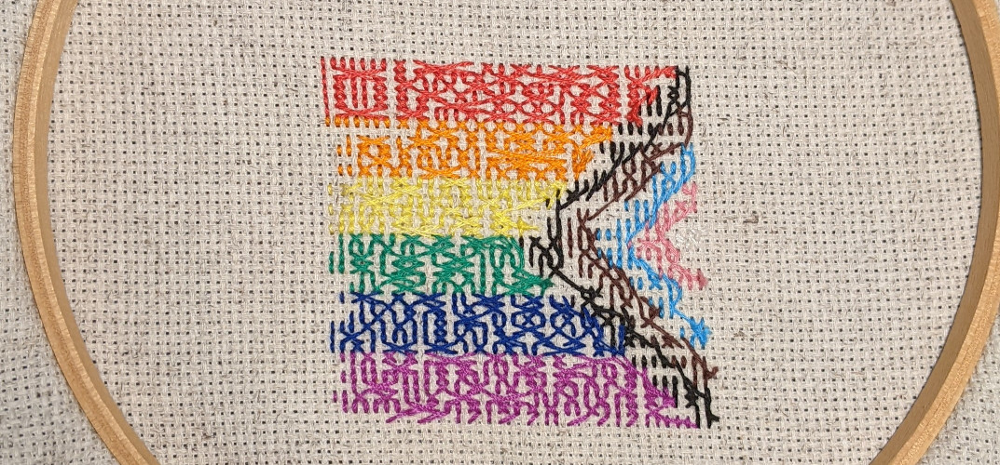
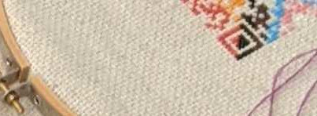
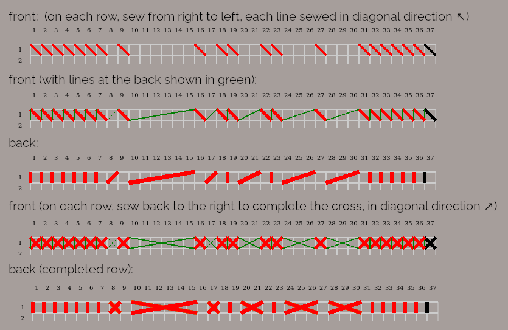
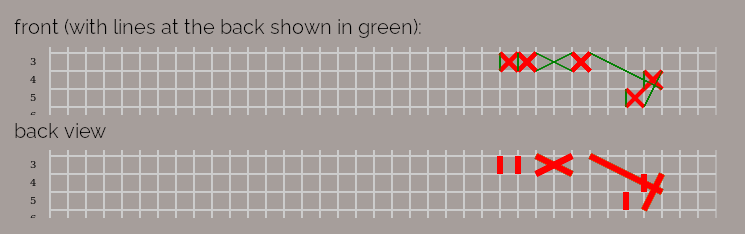
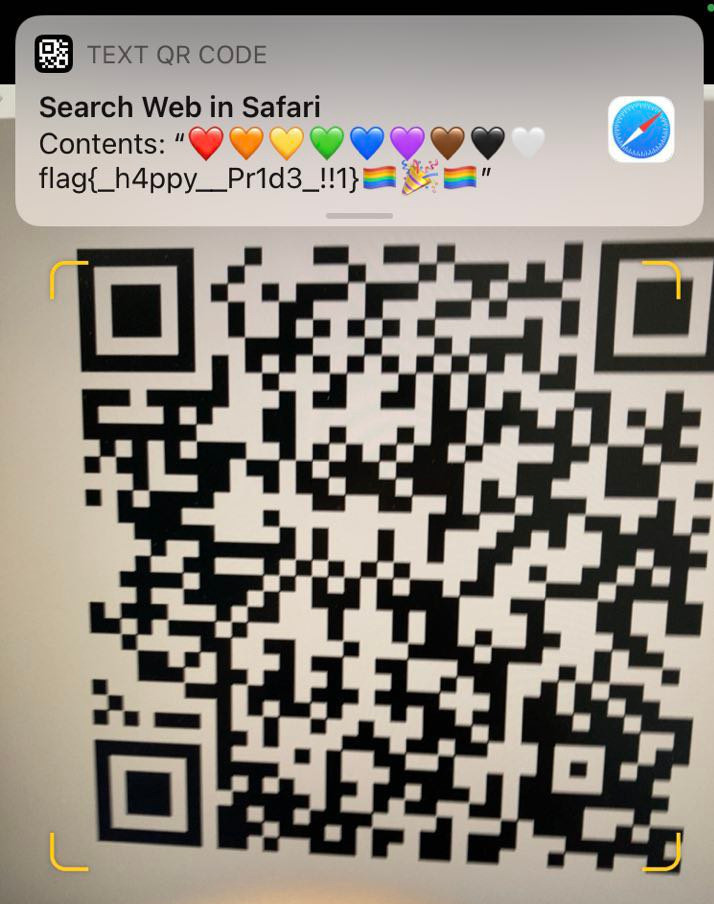

# Pride in Stitches

## Introduction

I did stitching... only during the first 3 years in college as in school lessons.

In this challenge, the following photo is given, which shows the back of the stitches. We need to determine the front side of it.

To make matter worse, the stitches are not completed yet. The photo above was released later during the CTF as a hint. The original photo shown at the start of the contest has two fewer rows at the bottom. See [pride_in_stitches.jpg](pride_in_stitches.jpg).

Luckily, in another challenge "Critter in the Orchard", a small part of the front side is shown, showing that the stitch is a QR code. Let's try to recover the QR code and scan to see what the text is!

## Figuring out how the back pattern is created

I never did cross stitches before, although I have heard about it. After some quick googling, I understand that a dark pixel is created by making a cross on the garment which has a grid of holes for sewing.

The back of the pattern seems neat, but I still need to figure out the exact sewing method. What I noticed is:

- Each line ends with a vertical line at the left side
- The messy part is always at the right

Being uncertain about relationship between the front and the back view, I simulated the front and the back view of the stitches as a proof of concept using HTML Canvas with JavaScript.

And I finally understand that how it is sewed, illustrated below.

- Perhaps this is a no-brainer for many who do needlework, but I am not one of them
- The front side in the illustration below is flipped horizontally so that the back pattern can be better illustrated, which matches with the provided back view photo.

The trickiest part is jumping to the next row. With this illustration in mind, we can conclude that:

When sewing from the top to bottom, during the row change, there will be a line that goes:
- from the _top right_ of the rightmost square of the _current_ row
- to the _bottom right_ of the rightmost squaure of the _next_ row

With this in mind, the whole sewing process becomes crystal clear. However reading the sewing lines was still a challenging task and required many proofreads.

Although the principles are simple, in reality I only grasped these concepts gradually as I studied the stitch patterns again and again.

## Studying the QR Code Specification

After a few iterations of proofreads, the code was still not getting scanned successfully.

I decided to study the QR code specification, which would help me validate my QR code.

It turned out that understanding the QR code format was a key step to minimize the manual errors as the specification imposes restrictions on the QR code layout.

QR code format specification includes:

- Size (version)
- Quiet zone
- Separators
- Alignment
- Timing
- Format information
- Masking
- Data encoding
- Data module content layout

Learning the QR code format gave me an important information: part of the incomplete stitch is indeed essential for proper QR code decoding - the encoding mode. It refers to the 2x2 squares at the bottom right corner of the QR code, i.e. the bottom left when viewed from the back.

With an initial guess as having `flag{}` in the message, I believed byte encoding is the way to go. And I had to also go through the process of demasking in order to determine what the 2x2 squares should be.

## Trying to manually decode the first character of the QR code

The QR code was still invalid at this point. So I tried to decode the QR code by hand to hunt for characters like `flag{`, I found some good QR code explanations and decoding tutorials on the internet, however some may not be applicable directly because this Version 5 QR code (37x37) has an alignment pattern. The most easy-to-follow tutorial (e.g. on YouTube) illustrates the manual decoding process using a small pattern which has no alignment patterns.

After some effort, I still had no luck on these because I don't find an ASCII character as the first character - the first byte code is larger than 128. I thought I understood the format wrongly (yet I finally understood, after getting the flag, feeling ashamed, that the first character is indeed an emoji).

## Trial and error, more trial and error...

I studied the QR code format, and kept proofreading the figure I produced. It turned out that my HTML/Canvas/JavaScript simulation tool is useful for the whole process, since it made the following much easier:

- seeing the back;
- seeing the front (flipped) with color;
- seeing the QR code for checking against the specification;
- producing the demasked QR code for checking the data module content;
- producing the final monochrome QR code for scanning.

It was also my first time to use HTML Canvas despite being a web developer for years.

## Final success

I re-visited each section multiple times, especially for the start and the end of each row, and at the boundaries between colors.

It was like after my 20th proofread, after 10 hours, that the QR code finally successfully got scanned.

Perhaps my eyes had become too tired after studying the stitches for so long, and I didn't catch the consecutive underscores looking at the flag shown on my phone, luckily my teammates reminded me on that.

I felt so satisfied after spending the hours figuring this out, having the message shown on my phone.

## What I learned

- I understood the basics of cross stitches, without actually picking up a needle. (?!)
- I knew how to determine the front side of a cross stitch merely by looking at the back. It will be useful in winning lunch bets. (?!)
- I learned the QR code format specification.
- I learned the basics of using HTML Canvas with JavaScript.

I liked how you would still need to study the QR code pattern even after the hint is given, where nearly the whole back side is shown except the last few squares, because they are critical squares to determine the encoding mode.

## Post-mortem

I got the photo of the completed stitch from the challenge author after the CTF ended.

Out of curiosity, I checked the number of errors I got: 9 squares.
- 2 of them are due to incomplete stitches;
- 4 of them are from my careless inputs;
- 3 of them are my reading errors.

According to the QR code specification, this QR code is using level L (low) as the data correction level, i.e. being able to recover 7% of data bytes. Although my error percentage seemed to be far lower than 7%, the QR code could not be scanned when I manually created two more error squares.

And in case you are wondering if this actual QR code stitch can be scanned, I can assure you: you cannot, because the yellow color is too light to represent a dark square.
