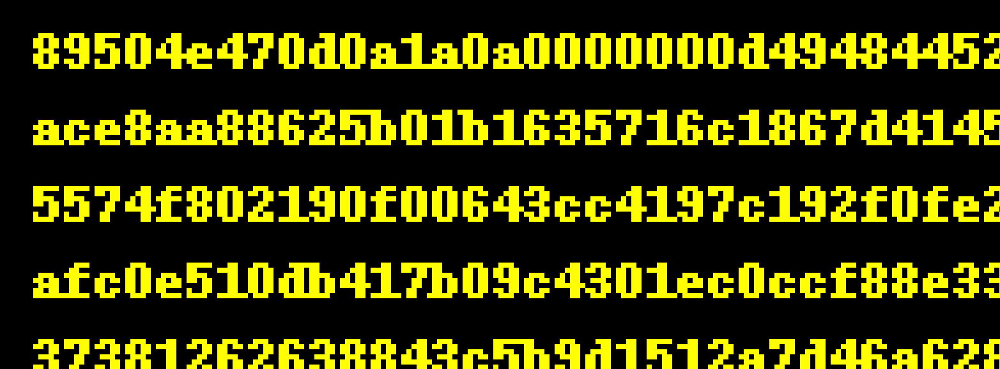
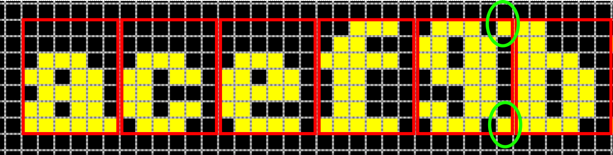
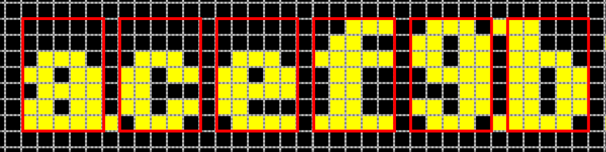

# Challenge 9 - Optical Character Frustration

## Description and Solving
- The `challenge.png` file is a 1215 x 18750 PNG file.

- Looking at the beginning hex 89504e47 tells me it should be a PNG file.
- Therefore the task should be reading all the characters in the PNG file and output the hex as PNG file.
- Initially I thought each character can be represented by a perfect 6-pixel width block so it would be easy to cut each character, however as I continued writing the code to cut the characters, I found out some characters like `b` could cross the border and it's not that super straight forward.

- To simply avoid the problem, I changed the character block to 5-pixel wide and the result is still perfect.

- Below is the code to be run using jupyter notebook which could better help visualize each character immediately.
- Writing the hex to a PNG file gives `result.png` that reveals the flag.


## Sample Python Code
```python
%matplotlib inline
from PIL import Image
import matplotlib.pyplot as plt
import numpy as np

img = Image.open('challenge.png')
img_np = np.array(img)

# grid info
x_start = 10
width = 6
y_start = 4
height = 15
n_char_per_line = int((img.size[0] - x_start) / width)
n_line = int((18724 - y_start) / height)
print(n_char_per_line, n_line)   # (200, 1248)

# store the ID of each char
char_id_map = {}

# initially empty, fill it in one by one when running the loop below
known_pos = {
    (0, 0): '8',
    (0, 1): '9',
    (0, 2): '5',
    (0, 3): '0',
    (0, 4): '4',
    (0, 5): 'e',
    (0, 7): '7',
    (0, 9): 'd',
    (0, 11): 'a',
    (0, 12): '1',
    (0, 31): '2',
    (0, 51): '6',
    (0, 63): 'b',
    (0, 71): 'c',
    (0, 77): '3',
    (0, 95): 'f',
}

# keep running below loop until positions of all 16 hex characters are filled in above
s = ''
end = False

for i in range(n_line):

    for j in range(n_char_per_line):

        char_img = img_np[y_start+i*height : y_start+(i+1)*height, x_start+j*width : x_start+(j+1)*width-1]
        a = np.sum(char_img, axis=2)
        a[a == 510] = 1   # just convert the yellow pixel sum(255,255,0) to 1 for short ID purpose
        # char_id is a 15x5 long string of either '0' or '1' which represents each pixel of the character
        char_id = ''.join([str(x) for x in a.flatten().tolist()])

        # first occurence of the character which we have identified already
        if (i,j) in known_pos:
            char_id_map[char_id] = known_pos[(i, j)]

        # user needs to identify the character and put it in known_pos dict
        if char_id not in char_id_map:
            print('i, j = ', i, j)
            plt.imshow(char_img)
            end = True
            break

        char = char_id_map[char_id]        
        s += char

    if end:
        break

# finally write as PNG
with open('result.png', 'wb') as f:
    f.write(bytes.fromhex(s))
```