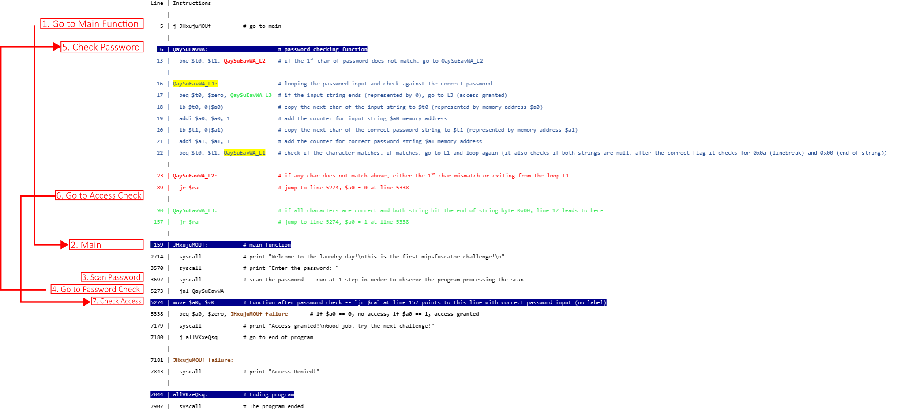

# Laundry Day

## Quick Glance
There is a single `.asm` file which contains assembly code from MIPS, as the description of the challenge suggested. I downloaded a MIPS debugger `MARS` and tried to run it. The program does the following:

1. Print `Welcome to the laundry day!\nThis is the first mipsfuscator challenge!\nEnter the password: `
2. Input a dummy password
3. Print `Access denied!`

Maybe trying to find a way to get access could reveal the flag?

## Debugging
The first step is probably understanding the control flow of the program through the assembly codes, as well as any printing or input scanning statements. From this [MIPS assembly guide](https://www.dsi.unive.it/~gasparetto/materials/MIPS_Instruction_Set.pdf), we want to get these instructions:

```
beq $1,$2,100      # if $1 == $2, go to 100
bne $1,$2,100      # if $1 != $2, go to 100
bgt $1,$2,100      # if $1 > $2,  go to 100
bge $1,$2,100      # if $1 >= $2, go to 100
blt $1,$2,100      # if $1 < $2,  go to 100
ble $1,$2,100      # if $1 <= $2, go to 100
j 1000             # go to address 1000
jr $1              # jump register -- go to address stored in $1
jal 1000           # jump and link -- making procedure call, set return address $ra, and jumpy to 1000
```

We also want to get the labels and all the print/scan statements. As all print/scan statements require a `syscall` instructions, we also want to get these instructions:

```
label_name:        # denote a label, for any goto statement to reference to
syscall            # used when printing / scanning statements, or other uses (not mentioning here)
```

So we get the below useful instructions
```
Line | Instructions
-----|-----------------------------------
   5 | j JHxujuMOUf
   6 | QaySuEavWA:
  13 | bne $t0, $t1, QaySuEavWA_L2
  16 | QaySuEavWA_L1:
  17 | beq $t0, $zero, QaySuEavWA_L3
  22 | beq $t0, $t1, QaySuEavWA_L1
  23 | QaySuEavWA_L2:
  89 | jr $ra
  90 | QaySuEavWA_L3:
 157 | jr $ra
 159 | JHxujuMOUf:
2714 | syscall
3570 | syscall
3697 | syscall
5273 | jal QaySuEavWA
5338 | beq $a0, $zero, JHxujuMOUf_failure
7179 | syscall
7180 | j allVKxeQsq
7181 | JHxujuMOUf_failure:
7843 | syscall
7844 | allVKxeQsq:
7907 | syscall
```

## Setting breakpoints
Next it is crucial to understanding where the printing or scanning statements are, in order to try to find out which part of the program corresponds to the part where the correct password is entered. We set breakpoints to all the `syscall` lines and observed what happened.

```
Line | Instructions
-----|-----------------------------------
   5 | j JHxujuMOUf
     |
   6 | QaySuEavWA:
  13 |   bne $t0, $t1, QaySuEavWA_L2
     |
  16 | QaySuEavWA_L1:
  17 |   beq $t0, $zero, QaySuEavWA_L3
  22 |   beq $t0, $t1, QaySuEavWA_L1
     |
  23 | QaySuEavWA_L2:
  89 |   jr $ra
     |
  90 | QaySuEavWA_L3:
 157 |   jr $ra
     |
 159 | JHxujuMOUf:
2714 |   syscall             # print "Welcome to the laundry day!\nThis is the first mipsfuscator challenge!\n"
3570 |   syscall             # print "Enter the password: "
3697 |   syscall             # scan the password -- run at 1 step in order to observe the program processing the scan
5273 |   jal QaySuEavWA
5338 |   beq $a0, $zero, JHxujuMOUf_failure
7179 |   syscall             # !! DID NOT GO HERE !!
7180 |   j allVKxeQsq
     |
7181 | JHxujuMOUf_failure:
7843 |   syscall             # print "Access Denied!"
     |
7844 | allVKxeQsq:
7907 |   syscall             # The program ended
```

## First Exploit: Getting Access
Now the control flow is somewhat obvious, with the wrong password it cannot go to line 7179. Perhaps we try to get there? Line 5338 looks like the way to exploit to avoid going to the label `JHxujuMOUf_failure`. I set a breakpoint there and modified `$a0` to `1`. It can go to line 7179 now, but it only prints `Access granted!\nGood job, try the next challenge!`. No Luck..

## Second Exploit: Maybe the password is the flag?
So we now dig deeper the codes and understand the whole program flow.
1. Start at line 5
2. Jump to line 159 `JHxujuMOUf`
3. Print the welcoming message and scan the password (lines 2714, 3570, 3697)
4. jump back to line 6 `QaySuEavWA` by line 5273
5. Some unknown things going through `L1`, `L2` and `L3` but it should finally go to a return address denoted by `$ra`.
6. It should somewhat go to line 5338 for checking the access.
7. If it has access then continue to print the `access granted` message at line 7179 and then jump to the end of the program from line 7180
8. else go to the failure part line 7181 and go till the end of the program.

The password check should be from those equality checking statements, so let's create breakpoints at lines 13, 17 and 22. I entered a password `ABA` to test it.

- 1st breakpoint (line 13)

It compares `$t0` and `$t1`, where `$t0` is `0x41`, i.e. `A`, 1st character of our input. `$t1` is `0x54`, i.e. `T` the 1st character of the flag prefix. So I changed `$t0` to `0x54` manually and continue.

- 2nd breakpoint (line 17)

Looks like nothing is happening

- 3rd breakpoint (line 22)

It agains compares `$t0` and `$t1`, where `$t0` is `0x42`, i.e. `B`, 2nd character of our input. `$t1` is `0x55`, i.e. `U` the 2nd character of the flag. I again changed `$t0` to `0x55` manually and continue

Then it loops through breakpoints at lines 17 and 22 iteratively to check all the characters of the password. So I proceeded to get the flag. Yay.

## Below is the actual control flow and meaning
I added more lines between line 17 and line 22 for detailed instructions explanation.




## How about directly add assembly codes to print out the password directly?

The original lines from 13 to 22 is inserted with these commented lines below to directly print the password when any password is inputted.
We needed to
1. modify the "user input password" $t0 in place to continue the password check, and also print the character.
2. `syscall` will print the character stored at `$a0` when `$v0` is `11`.
3. Since `$a0` is actively used, we use a dummy register `$t8` to hold its original value

Side note: I don't know how to directly print the entire flag string yet, instead of printing one character each time.

```mipsasm
move $t0, $t1   # copy the 1st char of password to user input password
li $v0, 11      # set instruction to print char
move $t8, $a0   # use temporary register to hold the existing $a0 value
move $a0, $t1   # move the char to be printed to $a0
syscall         # print the character at $a0
move $a0, $t8   # restore the value of $a0
bne $t0, $t1, QaySuEavWA_L2
addi $a1, $a1, 1
addi $a0, $a0, 1
QaySuEavWA_L1:
beq $t0, $zero, QaySuEavWA_L3
lb $t0, 0($a0)
addi $a0, $a0, 1
lb $t1, 0($a1)
addi $a1, $a1, 1
move $t0, $t1   # copy the 1st char of password to user input password
li $v0, 11      # set instruction to print char
move $t8, $a0   # use temporary register to hold the existing $a0 value
move $a0, $t1   # move the char to be printed to $a0
syscall         # print the character at $a0
move $a0, $t8   # restore the value of $a0
beq $t0, $t1, QaySuEavWA_L1
```