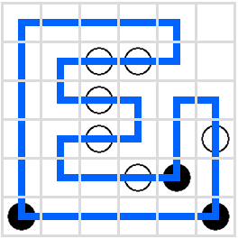
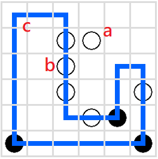

# ej

## Description

There is a stripped binary executable called `ej` provided, nothing else. After I solved this challenge, the admins added a clarficiation `You need the shortest possible solution`.

## Quick Glance
Upon executing the program, it prints the message below, indicating I need to solve a puzzle using up / down / left / right.
```
solve my puzzle for a flag ;)  (use u, d, l, r)
wait i forgot to implement the display functionality :/
```

## Puzzle Logic
By using Ghidra, going from FUN_001010a0 as the entry point to start main at FUN001019ff, it is easily traceable the grid is of 6x6 with criteria using `1` and `2` set like below.
```
......
..11..
..1...
..1..1
...12.
2....2
```

The starting point is at the top left corner and the goal is to find a route to satisfy requirements of `1` and `2` while going back to the starting point.
The checking of `1` and `2` are done in functions `FUN_00101479` and `FUN_001011fa` respectively.

## Reverse Engineering
Out of quick understanding I tried some paths manually, I could get the program to print "Correct!" but sadly it outputs garbage characters. From the logic I suppose there are many solutions, so I decided to write a DFS to exhaust the routes. Exhausting all the valid paths, I got the flag `wctf{ma5yu_puzz13s_4re_fUN!RL!1!}` with a 34-step commands `rrrrdllldrrdlldrrruurdddllllluuuuu`. I did make the assumption that no cell can be passed through more than once.



## Postscript
The flag indicates it is a `masyu` puzzle. A quick lookup at [wikipedia](https://en.wikipedia.org/wiki/Masyu) reveals the rule. Our program exhausts the paths and found the shortest path being 24-step commands, one sample being `rrddddrruurdddllllluuuuu`. However the challenge description asked to find the shortest path, what happened?

Turn out there are 3 crucial rules not implemented in this `ej` program:
- a. All circles have to be passed through.
- b. White circles must be traveled straight through, **but the loop must turn in the previous and/or next cell in its path**.
- c. The loop has to be a single continuous non-intersecting loop.

Without these rules, solutions like the above 24-step commands exist:



For rule `c`, adding `rl` before the 24-step commands, i.e. a meaningless right followed by left at the start, also prints `correct`.

If these rules are implemented, the 34-step commands are indeed the shortest and unique solution, in this case not counting the reversed direction one. The [masyu puzzle solver](https://www.noq.solutions/masyu) gives this result.
